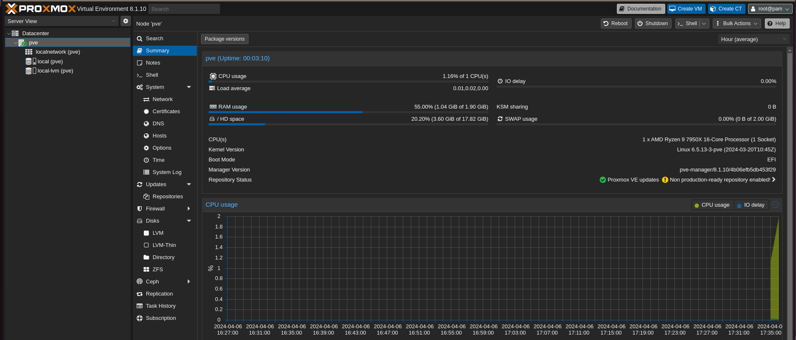

# vagrant-proxmox

This repository contains the code used to create the Vagrant box for Proxmox on VirtualBox. The box can be used to test Proxmox in a development environment and then destroyed when no longer needed.

## Versions

**Proxmox-VE 8**: https://app.vagrantup.com/clincha/boxes/proxmox-ve-8/  
**Proxmox-VE 7**: Coming soon  
**Proxmox-VE 6**: No plan to release (please raise an issue if you want it)

## Usage

Ensure you have met the following dependencies:

- Install Vagrant (https://www.vagrantup.com/downloads)
- Install Oracle VM VirtualBox (https://www.virtualbox.org/wiki/Downloads)

### VagrantFile

```ruby
Vagrant.configure("2") do |config|
  config.vm.box = "clincha/proxmox-ve-8"
  config.vm.box_version = "0.0.1"
end
```

### CLI

```bash
vagrant init clincha/proxmox-ve-8 --box-version 0.0.1
vagrant up
```

## Using the box

### SSH

You can SSH into the server using the following command:

```bash
vagrant ssh
```

Alternatively, you can run the following command to SSH into the server:

```bash
ssh -p 2222 vagrant@127.0.0.1
``` 

### Web Interface

You can access the Proxmox web interface by navigating to `https://127.0.0.1:8006` in your browser. The default username is `root` and the password is `vagrant`.

